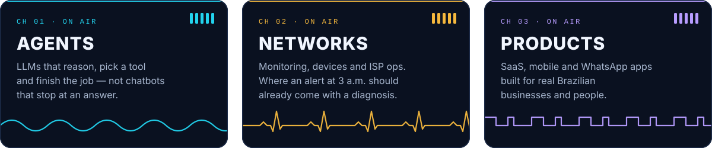

  

  
  
  

  <b>I build software that listens, decides and acts.</b> 
  From AI agents that keep internet providers online to products used by barbers, farmers and small shops across Brazil.

<h3 align="center">📻 &nbsp;Tuned to three frequencies</h3>

  

<h3 align="center">🛰️ &nbsp;Current transmissions</h3>

  

<h3 align="center">🎛️ &nbsp;Signal chain</h3>

  

  <code>LangGraph</code> · <code>MCP</code> · <code>Ollama</code> · <code>pgvector</code> · <code>Zabbix</code> · <code>GenieACS</code> · <code>React Native</code>

  

  
  

